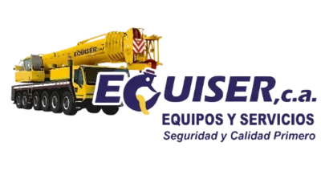

# GRÚAS EQUISER C.A. - Sitio Web Oficial



## 🏗️ Sobre EQUISER

**GRÚAS EQUISER C.A.** es una empresa líder en Venezuela especializada en:

- 🏭 **Grúas Móviles Hidráulicas** (25-450 toneladas)
- 🔧 **Grúas Sobre Oruga** (300-1600 toneladas)
- 🚛 **Transporte de Carga Sobredimensionada**
- ⚙️ **Rigging e Izamiento Industrial**

### Sectores Atendidos
- Petrolero y Petroquímico
- Energético y Eléctrico
- Siderúrgico e Industrial
- Portuario y Logístico

## 🚀 Tecnologías

- **Framework**: Next.js 14
- **Estilos**: Tailwind CSS
- **Base de Datos**: PostgreSQL + Prisma
- **Animaciones**: Framer Motion
- **i18n**: next-intl (Español/Inglés)

## 📦 Instalación

```bash
# Instalar dependencias
yarn install

# Generar cliente Prisma
yarn prisma generate

# Iniciar servidor de desarrollo
yarn dev
```

## 🌐 URLs

- **Producción**: [gruasequiser.com](https://gruasequiser.com)
- **Desarrollo**: localhost:3000

## 📞 Contacto

- **Teléfono**: +58 422-6347624 | +58 414-3432882
- **Email**: info@gruasequiser.com
- **WhatsApp**: [Contactar](https://wa.me/message/IOBBJVBBVWNOI1)
- **Instagram**: [@gruasequiservzla](https://instagram.com/gruasequiservzla)

## 📄 Licencia

© 2024-2026 GRÚAS EQUISER C.A. Todos los derechos reservados.

---

*Seguridad y Calidad Primero*
